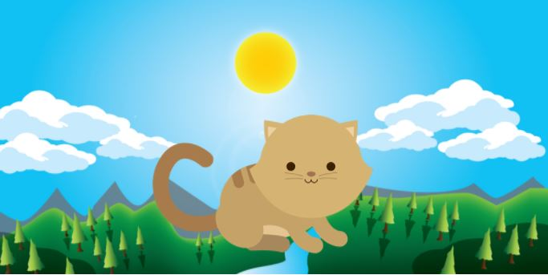
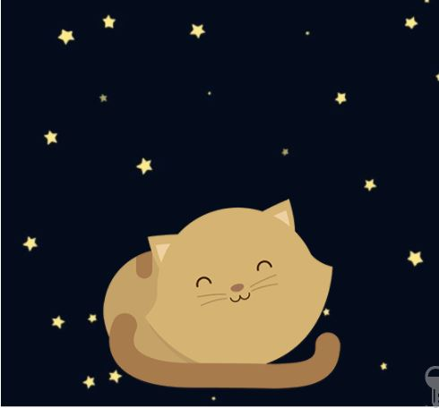
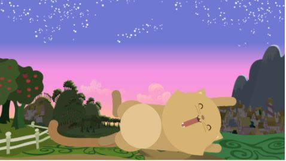
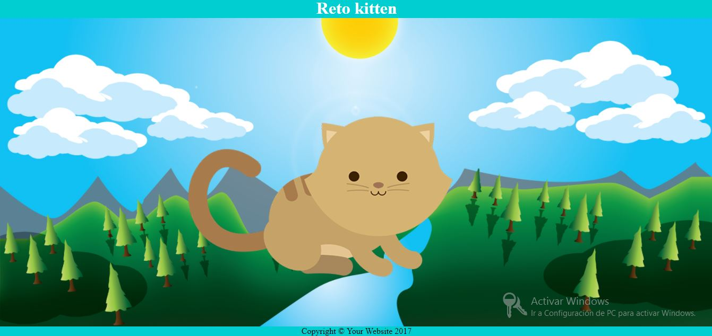
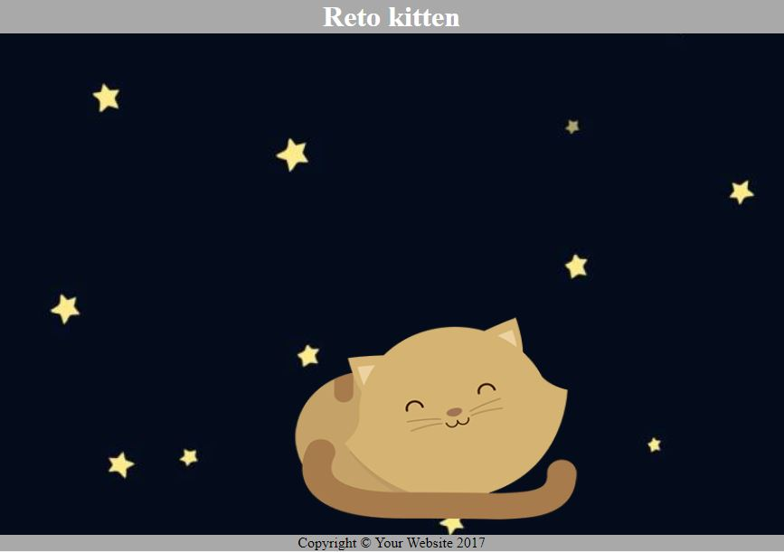
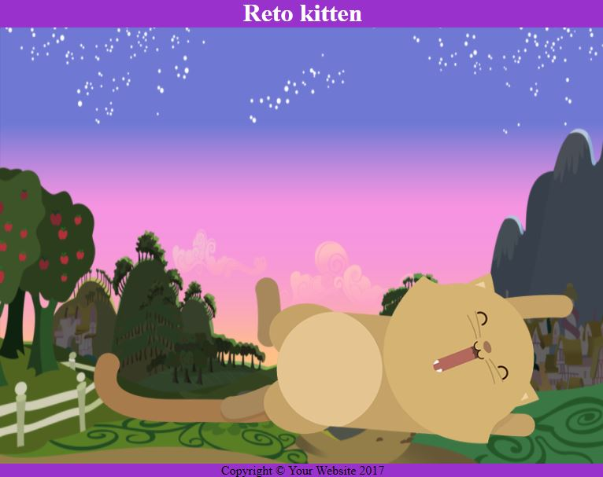

# Reto Kitten
## Autor: Melissa Yauri
***
## Objetivo
Crear una página web donde se muestre un paisaje y un gatito diferente a medida que la ventana del navegador se haga más pequeña.Los tamaños son de la siguiente forma:
## layaout
* Tamaño grande

* Tamaño mediano

* Tamaño pequeño

## Resultado
Para este reto se utilizo la herramienta `media queries` para establecer los cambios de la ventana del navegador.Se realizó las siguientes medidas:

* Tamaño grande: Alrededor de un ancho de 1400px y es el que se encuentra de manera predeterminada cuando carga la web.

*  Tamaño mediano: Cambia de imagen cuando tiene un ancho máximo de 900px.

*  Tamaño pequeño: Último cambio de imagen cuando tiene un ancho máximo de 800px.

